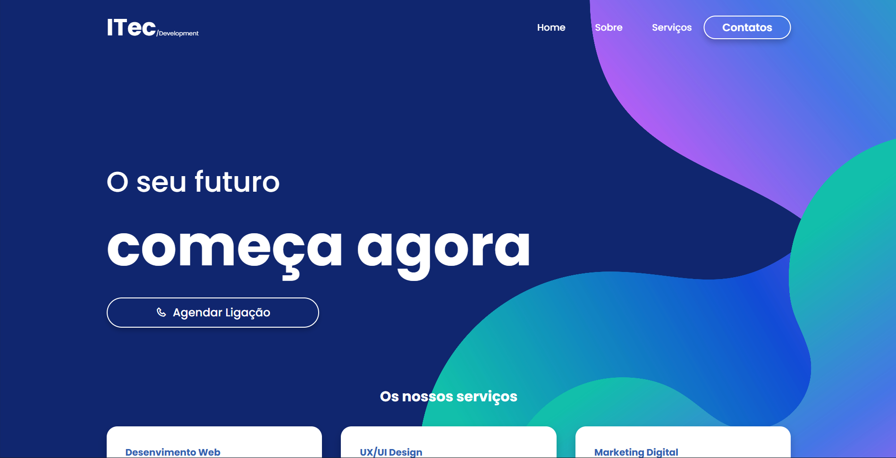

# ITEC Development

Website institucional da **ITEC Development**, uma empresa focada em soluções digitais modernas, escaláveis e orientadas a resultados.

---

## 📌 Sobre o Projeto

Este projeto representa a presença online da **ITEC Development**, apresentando os nossos serviços, equipa, competências técnicas e valores. A página foi desenvolvida com foco em **performance**, **responsividade**, **SEO** e **boas práticas de desenvolvimento web**.

---

## 🖥️ Demonstração

### 📷 Pré-visualização do Website

> Substitui a imagem abaixo por um screenshot real do projeto.



---

## 🛠️ Tecnologias Utilizadas

* HTML5 (estrutura semântica)
* CSS3 (Grid, Flexbox, animações e responsividade)
* JavaScript (interações e comportamento dinâmico)
* Metodologia BEM para organização do CSS

---

## 📂 Estrutura do Projeto

```
itec-development/
│
├── index.html
├── assets/
│   ├── img/
│   │   ├── preview/
│   │   └── team/
│   └── icons/
│
├── css/
│   ├── base/
│   ├── components/
│   ├── sections/
│   └── import.css
│
├── js/
│   ├── modules/
│   └── import.js
│
└── README.md
```

---

## 🚀 Funcionalidades

* Layout totalmente responsivo
* Navbar com dropdown e menu mobile
* Seções institucionais (Sobre, Serviços, Equipa, Skills, Testemunhos)
* Animações suaves e interações ao scroll
* Estrutura preparada para SEO

---

## 📈 Objetivo

Criar uma base sólida para um website corporativo que possa ser facilmente escalado, personalizado e integrado a novos serviços ou funcionalidades no futuro.

---

## 📸 Como adicionar imagens ao README

1. Cria a pasta:

   ```
   assets/img/preview/
   ```
2. Adiciona a imagem (ex: `homepage.png`)
3. Usa no README:

   ```md
   
   ```

---

## 📄 Licença

Este projeto é de uso privado e institucional da **ITEC Development**.

---

## 👨‍💻 Autor

**ITEC Development**
Soluções digitais que constroem o futuro.

---

> Projeto em evolução contínua.
